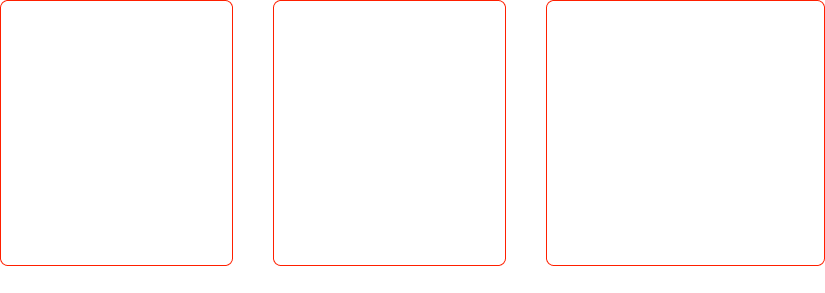
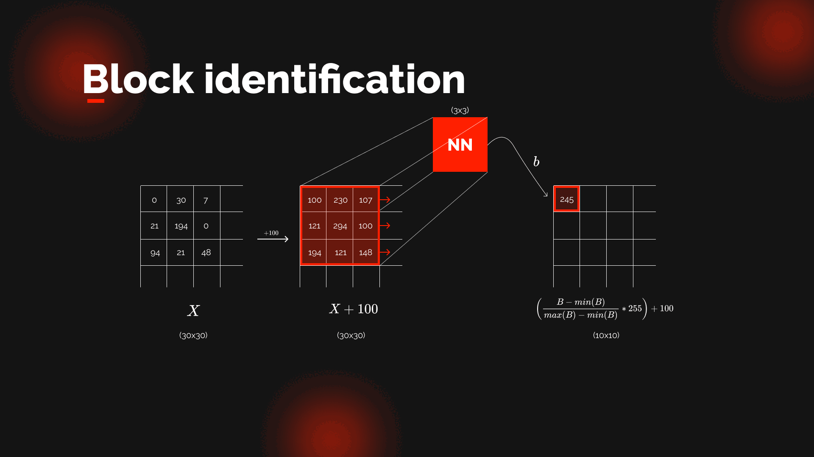
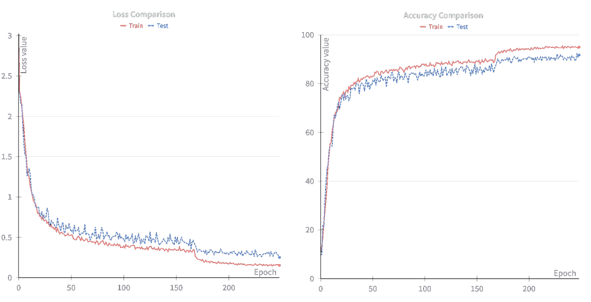
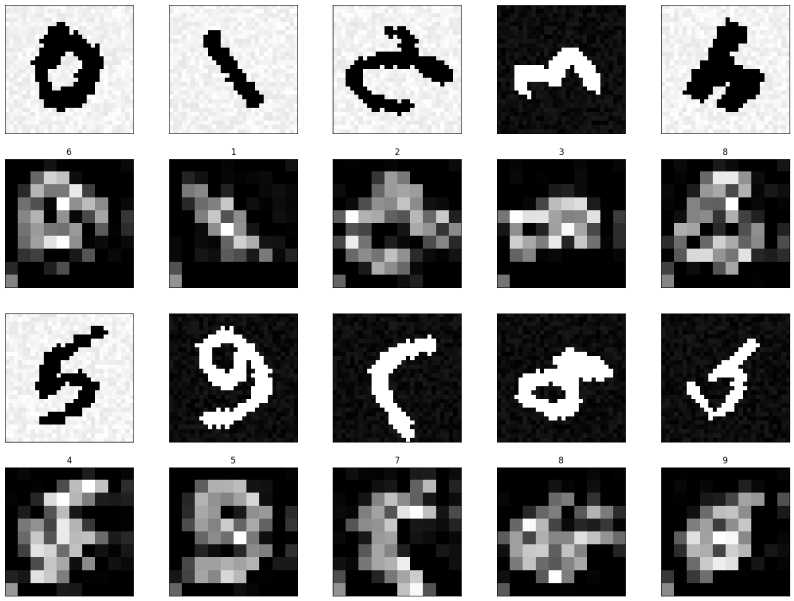
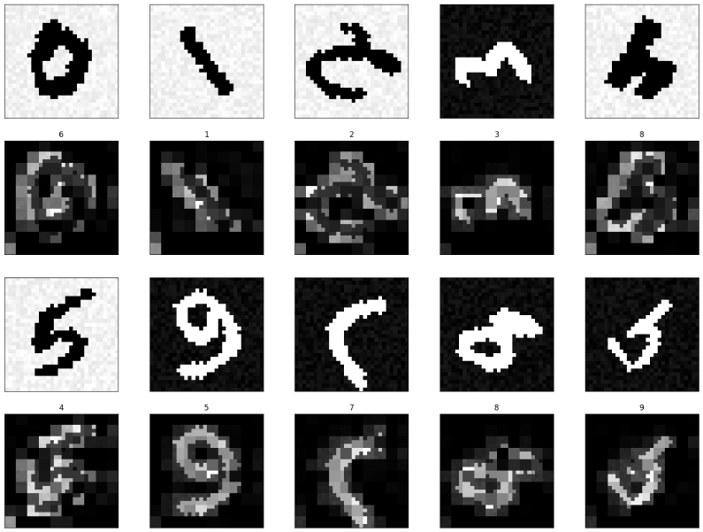

# Lighter - University Project
In this repo we propose an interpretable architecture that makes possible to understand in which part of the image a classifier is focusing on to make the classification. It is based on a simple attention layer which learns, through the training, which area are relevant in order to make the right classification: it is able to turn off the unnecessary pixels setting them to 0.

The architecture is composed as follows:

and the input goes through the following steps:

We train the model on the MNIST dataset and also used some data augmentation(noise, rotation and pixel inversion). We setted a _batch\_size = 64_ and a starting _lerning\_rate = 1e-03_. 

## Results
We obtained the following stats from the training:
- Train Accuracy: 95%;
- Test Accuracy: 92%.

Here is shown the entire behaviour of the loss and accuracy during the epochs(some _learning\_rate_ tuning has been applied):

These are some _attention\_layer_ examples: in the first row there is the first input, in the second one the layer.

It is interesting to see that, when the background is white, the model is able to turn off the unnecessary pixels, setting them to black.

Here, instead, we show how the input is seen by the classifier:

The classifier is able to focus on the right area of the image to make the classification.

It is still not understood why the lower-left pixel block is always considered important by the model.